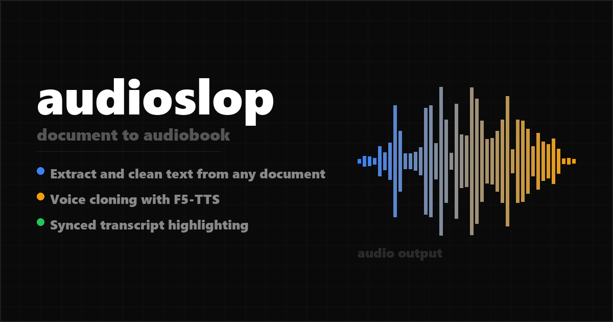

# audioslop

<p align="center">
  
</p>

[](LICENSE)
[](https://www.python.org)
[](https://github.com/SWivid/F5-TTS)
[](https://github.com/openai/whisper)
[](https://github.com/jamditis/audioslop/issues)
[](https://github.com/jamditis/audioslop/commits/master)

A document-to-audiobook pipeline with a web UI. Upload documents, clean text for TTS, generate audio with voice cloning, and listen with a synced transcript player that highlights words as they're spoken.

## What it does

1. **Extract and clean** text from .docx, .pdf, .srt, .txt, and .md files. Strips abbreviations, footnotes, URLs, and other content that trips up voice models.
2. **Generate audio** using F5-TTS with zero-shot voice cloning from a short reference recording. Includes per-segment QA verification via Whisper transcription.
3. **Listen with synced transcript** -- words highlight in real time as the narrator reads, like an immersive reader. Click any word to seek to that position.

## Requirements

- Python 3.10+
- NVIDIA GPU with CUDA (tested on RTX 4080 Super, 16GB VRAM)
- ~2GB disk space for models (downloaded automatically on first run)

## Setup

```bash
git clone https://github.com/jamditis/audioslop.git
cd audioslop

pip install flask f5-tts whisper python-docx pdfplumber

# Create directories for user data
mkdir ref uploads jobs content output audio

# Copy your voice reference clip (5-15 seconds of speech, .wav format)
cp /path/to/your/voice.wav ref/

# Configure
cp .env.example .env
# Edit .env with your password and secret
```

## Usage

### Web UI

```bash
python app.py
```

Open `http://localhost:5000`. Log in with the password from your `.env` file.

1. Upload a document on the home page
2. Review and edit the cleaned text
3. Click "Generate audio" to start synthesis
4. Listen in the player with synced word highlighting

### Command line

The pipeline scripts work standalone without the web UI:

```bash
# Clean a document for TTS
python audioslop.py content/mybook/ -o output/mybook/

# Generate audio from cleaned text
python synthesize.py output/mybook/ --ref-audio ref/voice.wav -o audio/mybook/

# Verify audio quality
python qa.py audio/mybook/ --source output/mybook/
```

## Architecture

```
Browser (HTML/JS/Tailwind)
    |
Flask API (app.py)
    |
Background worker (worker.py)
    |
Pipeline: audioslop.py -> synthesize.py -> qa.py
    |
F5-TTS (voice synthesis) + Whisper (verification + word timestamps)
```

The web UI wraps three standalone Python scripts:

- `audioslop.py` -- Multi-format text extraction, TTS-specific cleaning (abbreviation expansion, dash normalization, footnote removal), and size-based chunking
- `synthesize.py` -- F5-TTS synthesis with per-paragraph generation, structural pauses between segments, and a QA verification loop
- `qa.py` -- Whisper-based transcription verification with word-level timestamps, accuracy scoring, and flow analysis

The player uses Whisper's word-level timestamps to sync transcript highlighting to audio playback via binary search on a flat timeline array, updated every animation frame.

## Voice cloning

F5-TTS clones any voice from a short reference recording. For best results:

- Record 5-15 seconds of natural speech in a quiet room
- Save as .wav format
- The model mirrors whatever speaking style it hears in the reference

## Configuration

| Variable | Default | Purpose |
|----------|---------|---------|
| `AUDIOSLOP_PASSWORD` | (required) | Web UI login password |
| `AUDIOSLOP_SECRET` | `dev-secret-change-me` | Flask session secret (change in production) |

## Project structure

```
audioslop/
├── app.py            # Flask web app and API routes
├── worker.py         # Background job processing thread
├── audioslop.py      # Text extraction and TTS cleaning
├── synthesize.py     # F5-TTS synthesis with QA loop
├── qa.py             # Transcription verification and timing
├── db.py             # SQLite database layer
├── activity.py       # Per-job event logging
├── static/
│   ├── app.css       # Styles
│   └── player.js     # Audio player and transcript sync engine
├── templates/        # Jinja2 templates (upload, review, player)
├── tests/            # pytest test suite
└── docs/             # Design specs and implementation plans
```

## License

MIT
